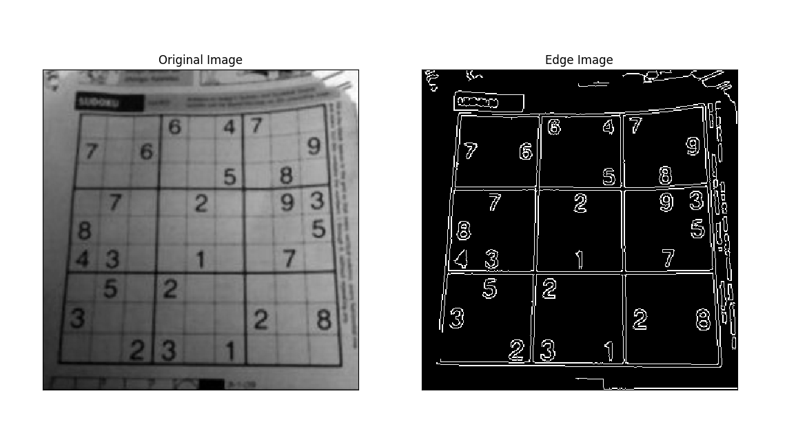
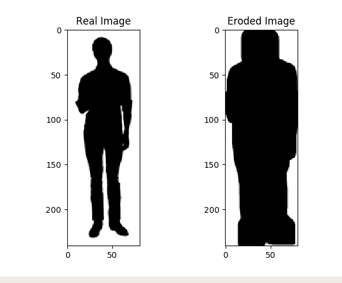
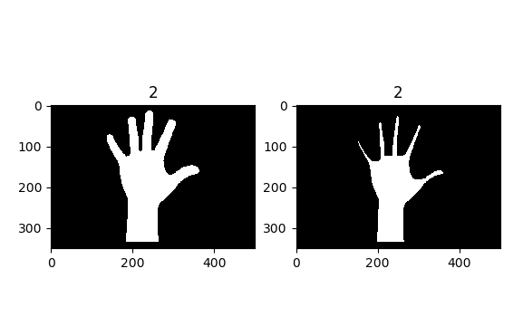
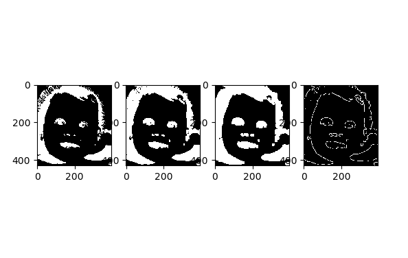
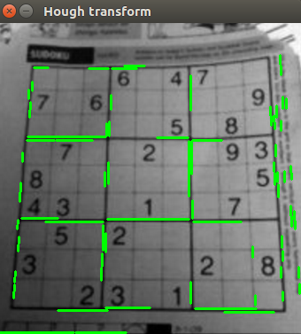
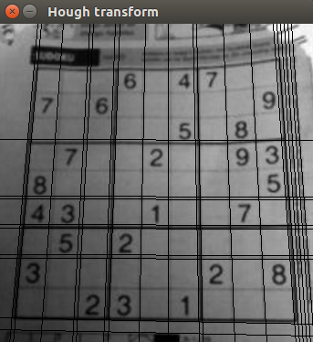
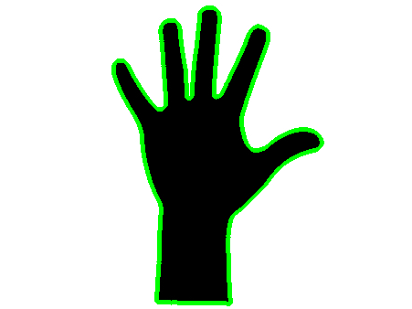
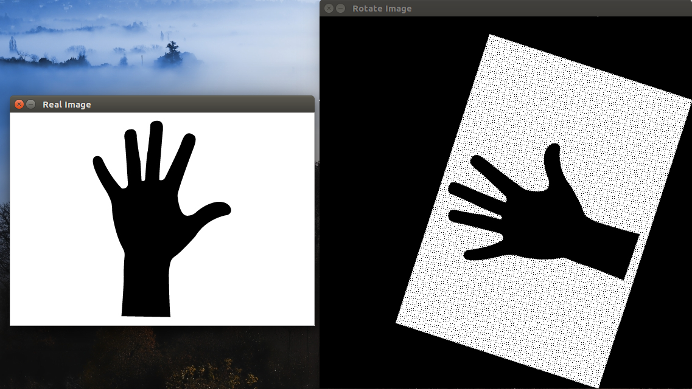
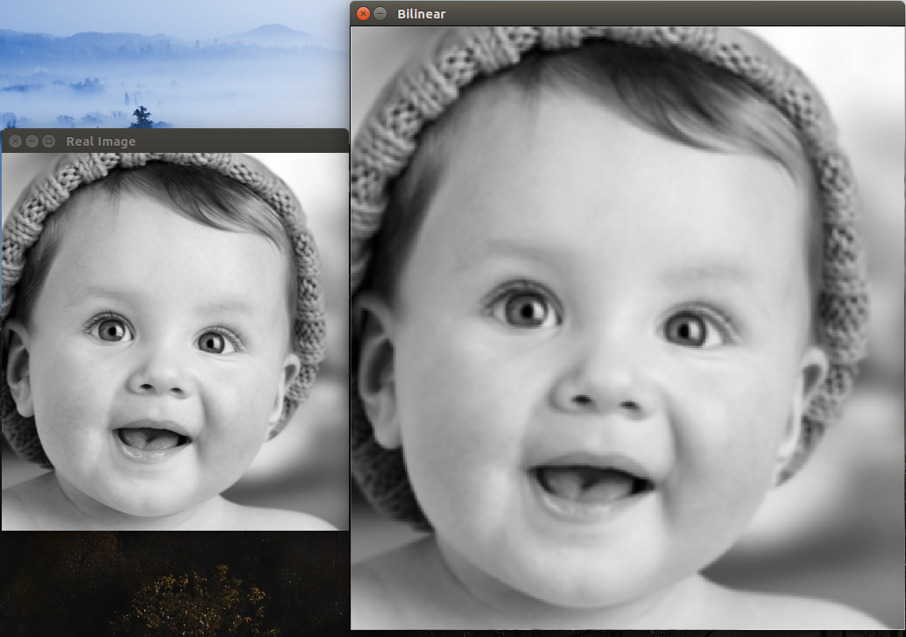
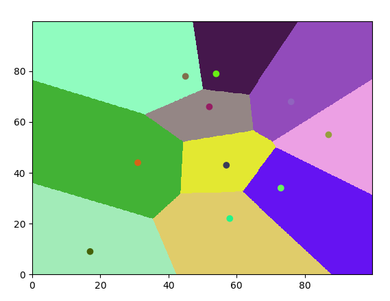

Computer Vision
====================
This project contains some snippets, code, algorithms of Computer Vision that you may find useful.  

Projects using CV
------------------------

 - [ Tracking ]( https://github.com/xdanielsb/TrackImages )
 - [ Grade exams ]( https://www.youtube.com/watch?v=uTyJL015c90 )

Examples
------------------------

Prewit
------

Canny
-----

Opening
-------

Closing
-------

Hit or Miss
-----------

Erotion
-------

Thining
-------

Gradient
--------

Dilate
------

Skeleton
--------

Probabilistic Hough
-------------------

Hough Transform
---------------

Contour
-------

Rotate
------

Bilinear Interpolation
----------------------

Bicubic Interpolation
---------------------

Knn Interpolation
-----------------

Meshgrid Knn
------------

Knn from scratch
----------------

Threshold 
---------

Adding Images 
-------------

Equalize Histogram
------------------

Histogram
---------

Flood fill
----------

License
-------

This project is licensed under the GPL V3 License - see the [LICENSE](LICENSE) file for details
